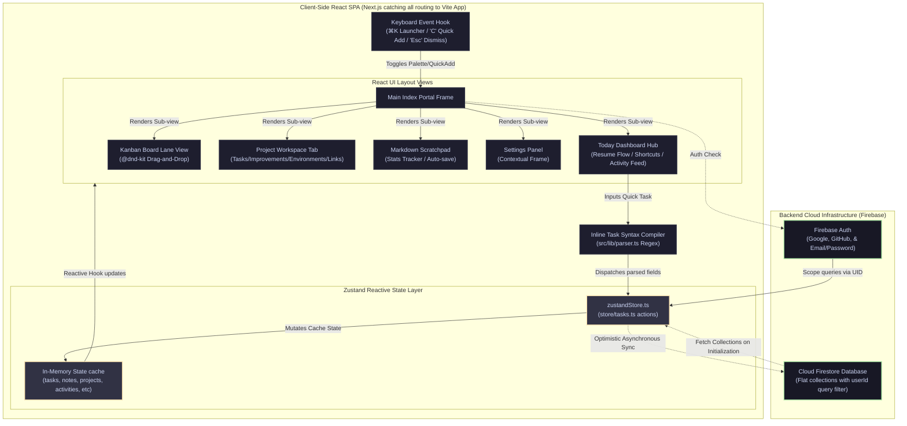
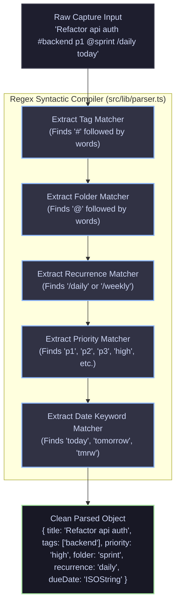

# Developer OS ⚡

Developer OS is a keyboard-first, low-latency developer productivity workstation, daily planner, and project dashboard. Built for zero-latency interactions and engineered as a central command center for engineering workflows, it consolidates daily work standup logs, Kanban task boards, custom script playbooks, project contexts, environment configurations, scratchpads, and activity feeds.

---

## 🚀 Key Features

*   **Keyboard-First Command Palette**: Navigate between views, search notes/tasks, toggle visual themes, or trigger quick capture dialogs instantly using the global search palette launcher (`⌘K` or `/`).
*   **Today's Productivity Hub**: Track tasks due today and overdue items, access pinned console shortcuts, inspect the global activity stream, and view real-time workspace metrics.
*   **Resume Work Session**: Quick-launch buttons that serialize the developer's last-active state (active project, last edited note, last copied CLI command, and last active view) across browser reloads.
*   **Interactive Kanban Board**: Structure active workflows across `Todo`, `Doing`, and `Done` columns using drag-and-drop cards powered by `@dnd-kit/core` and `@dnd-kit/sortable`.
*   **Regex-Based Quick-Add Compiler**: Capture tasks rapidly using a syntax compiler (located in `src/lib/parser.ts`) that extracts priorities (`p1`/`p2`/`p3`/`high`/`medium`/`low`), tags (`#tag`), folder paths (`@folder`), recurrence (`/daily` or `/weekly`), and due date keywords (`today`/`tomorrow`/`tmrw`/`tmr`) from a single input string.
*   **Integrated Project Workspaces**: Centralized dashboards for engineering projects. Each workspace includes task checklists, priority improvements, markdown project notes, custom resource bookmark links, script command lists, and editable Dev/Stg/Prod environment sheets.
*   **Global Markdown Scratchpad**: A dedicated markdown editor with live word and character statistics, custom font sizing, and automated debounced persistence.
*   **Standalone Notes & Daily Logs**: Maintain formatted markdown notes and automated standup logs linked to specific calendar days.
*   **Terminal Playbooks Registry**: Maintain a list of frequently run terminal scripts. Supports parameter placeholder substitutions (e.g., `{{image_name}}`) that users can interactively fill and copy directly to the terminal clipboard.
*   **Cross-Platform Authentication**: Secure authentication supporting Google Sign-In, GitHub Sign-In, and standard Email/Password accounts powered by Firebase Authentication.

---

## 🛠️ Technology Stack

*   **Framework**: Next.js 14 (configured as a single-page application router catch-all to prevent SSR hydration mismatches with client-side state)
*   **Frontend**: React 18, TypeScript, Tailwind CSS
*   **State Management**: Zustand reactive stores (`src/store/tasks.ts`) with optimistic UI rendering and async database background synchronization
*   **Drag & Drop**: `@dnd-kit/core` and `@dnd-kit/sortable`
*   **UI Components**: Radix UI Primitives, Lucide Icons, Shadcn UI, Tailwind CSS
*   **Database & Auth**: Firebase SDK v10 (Authentication & Cloud Firestore)

---

## 🏗️ System Design & Architecture

Developer OS relies on a single Zustand store acting as the reactive single source of truth for tasks, notes, folders, projects, improvements, activities, and scratchpads. 

### 1. In-Depth Component & Reactivity Architecture

The diagram below details the client-side SPA architecture, reactive state layer, and the sync paths to the Firebase backend.

> [!NOTE]
> **Mermaid Diagrams Rendering:** If you see raw text block code like `graph TD` below, it is because your local text editor does not have a Mermaid preview extension active. Once pushed to **GitHub**, these blocks will automatically render into interactive visual system diagrams.



### 2. High-Performance Syntactic Compiler

Instead of using high-latency external AI models to categorize tasks, inputs are compiled synchronously in under `1ms` using the following regex pipeline:



### 3. Database Schema & Firestore Collections

All database schemas are stored as **flat root-level collections** in Cloud Firestore. Documents contain a `userId` field, and the client SDK filters queries by the authenticated user's ID:

*   **`dev_folders`**: Folders for grouping tasks.
    ```typescript
    interface Folder {
      id: string;
      userId?: string;
      name: string;
      color?: string;
    }
    ```
*   **`dev_tasks`**: Engineering and operational tasks.
    ```typescript
    interface Task {
      id: string;
      userId?: string;
      title: string;
      description?: string;
      status: "todo" | "doing" | "done";
      priority: "low" | "medium" | "high";
      tags: string[];
      folder: string;
      dueDate?: string;
      recurrence: "none" | "daily" | "weekly";
      subtasks: Subtask[];
      createdAt: string;
      completedAt?: string;
      notes?: string;
      links?: LinkRef[];
      linkedNoteIds?: string[];
      projectId?: string; // Foreign key reference to active project
    }
    ```
*   **`dev_notes`**: Standalone markdown documentation and daily standup logs.
    ```typescript
    interface Note {
      id: string;
      userId?: string;
      title: string;
      content: string;
      kind: "note" | "daily";
      dayKey?: string; // YYYY-MM-DD for daily standup log instances
      linkedTaskIds: string[];
      createdAt: string;
      updatedAt: string;
      projectId?: string; // Associated project context
    }
    ```
*   **`dev_commands`**: Global or project-level terminal command snippets.
    ```typescript
    interface Command {
      id: string;
      userId?: string;
      label: string;
      command: string;
      category: string;
      createdAt: string;
      projectId?: string;
    }
    ```
*   **`dev_projects`**: Software projects and asset metadata.
    ```typescript
    interface Project {
      id: string;
      userId?: string;
      name: string;
      description?: string;
      githubRepo?: string;
      firebaseProject?: string;
      vercelProject?: string;
      createdAt: string;
      environments: {
        development: ProjectEnvironment;
        staging: ProjectEnvironment;
        production: ProjectEnvironment;
      };
      links?: LinkRef[]; // Custom workspace bookmark resources
    }
    ```
*   **`dev_improvements`**: Technical checklist improvements linked to active projects.
    ```typescript
    interface Improvement {
      id: string;
      userId?: string;
      projectId: string;
      title: string;
      done: boolean;
      priority?: "low" | "medium" | "high";
      createdAt: string;
    }
    ```
*   **`dev_activities`**: System-wide developer activity stream logs.
    ```typescript
    interface ActivityLog {
      id: string;
      userId: string;
      type: "task_completed" | "note_edited" | "command_copied" | "deployment_opened" | "project_updated" | "improvement_completed";
      message: string;
      timestamp: string;
      metadata?: Record<string, any>;
    }
    ```
*   **`dev_scratchpads`**: Context-persistent markdown scratchpad data.
    ```typescript
    interface Scratchpad {
      userId: string;
      content: string;
      updatedAt: string;
    }
    ```
*   **`dev_preferences`**: Settings configurations (document ID corresponds to `user.uid`).
    ```typescript
    interface UserPrefs {
      theme: "light" | "dark";
    }
    ```

---

## ⚙️ Setup & Local Installation

### Prerequisites
*   Node.js 18+ or Bun
*   A Firebase project with **Email/Password**, **Google Provider**, and **GitHub Provider** enabled in Authentication, and **Cloud Firestore** initialized.

### Getting Started

1.  **Clone the Repository & Install Dependencies**
    ```bash
    git clone https://github.com/your-username/developer-os.git
    cd developer-os
    npm install
    # or using Bun
    bun install
    ```

2.  **Configure Environment Variables**
    Create a `.env` file in the root directory:
    ```env
    NEXT_PUBLIC_FIREBASE_API_KEY=your_firebase_api_key
    NEXT_PUBLIC_FIREBASE_AUTH_DOMAIN=your_firebase_auth_domain
    NEXT_PUBLIC_FIREBASE_PROJECT_ID=your_firebase_project_id
    NEXT_PUBLIC_FIREBASE_STORAGE_BUCKET=your_firebase_storage_bucket
    NEXT_PUBLIC_FIREBASE_MESSAGING_SENDER_ID=your_firebase_messaging_sender_id
    NEXT_PUBLIC_FIREBASE_APP_ID=your_firebase_app_id
    ```

3.  **Run the Local Development Server**
    ```bash
    npm run dev
    ```
    Open [http://localhost:3000](http://localhost:3000) to access the application.

4.  **Production Compilation**
    ```bash
    npm run build
    npm run preview
    ```

---

## 🗺️ Project Structure

*   `app/` - Next.js dynamic routing entry points
*   `src/` - Core application source
    *   `components/flow/` - Layout workspaces (TodayView, Board, NotesView, CommandsView, ProjectWorkspace, ScratchpadView, Sidebar)
    *   `components/ui/` - Reusable Shadcn UI primitives
    *   `contexts/` - Auth Context providers
    *   `lib/` - Shared types, Firestore database operations (`firestoreData.ts`), regex parser compiler (`parser.ts`), and utility helpers
    *   `store/` - Zustand global state controllers (`tasks.ts`)
    *   `views/` - Root visual pages (Landing, Auth, Index, Settings)

---

## 📄 License & Contributing

*   **Contributing**: We welcome open-source contributions! Please review our [Contributing Guidelines](CONTRIBUTING.md) to learn how to propose changes, write code guidelines, and run tests.
*   **License**: This project is licensed under the MIT License. See the [LICENSE](LICENSE) file for details.
