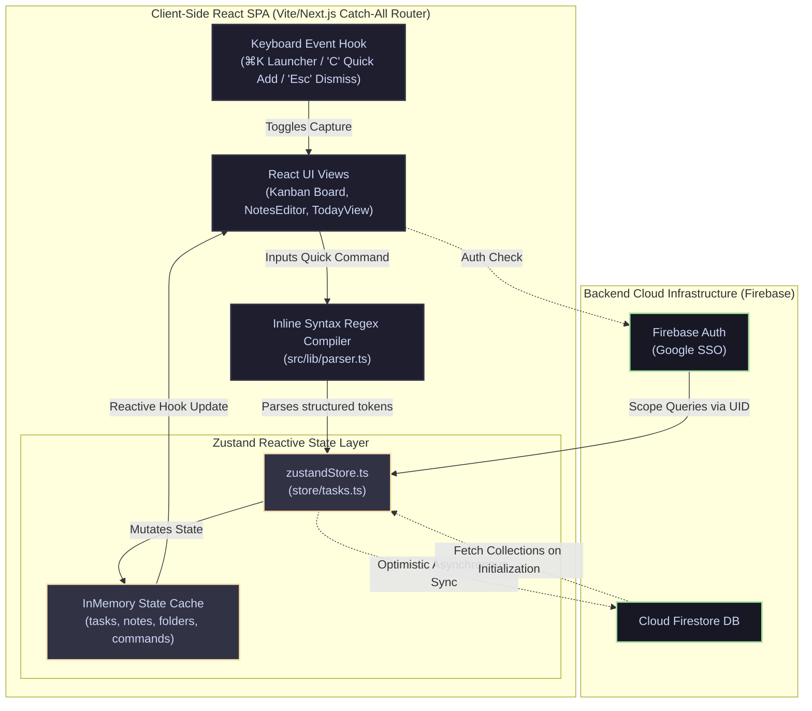
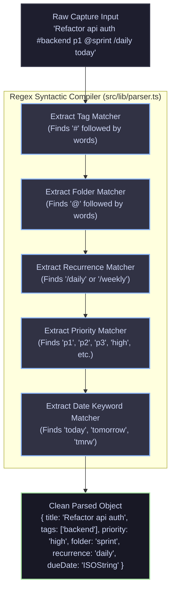

# Developer OS ⚡

Developer OS is a keyboard-first, low-latency developer productivity workspace, daily planner, and project dashboard. Built for zero-latency interactions, it consolidates daily logs, kanban pipelines, quick notes, and script playbooks under a glassmorphic user interface.

---

## 🚀 Key Features

*   **Keyboard-First Command Palette**: Navigate between workspaces, search tasks, toggle visual themes, or execute commands instantly using the global palette launcher (`⌘K`).
*   **Today's Productivity Hub**: Track overdue tasks, manage today's schedule, and write your daily standup logs using built-in Markdown templates (e.g., tasks completed, blockages, next steps).
*   **Interactive Kanban Board**: Organize and reorder task cards across `Todo`, `Doing`, and `Done` columns using fluid drag-and-drop lanes powered by `@dnd-kit/core` and `@dnd-kit/sortable`.
*   **Task Inline Syntax Parser**: Capture tasks rapidly using a regex-based syntax compiler (located in `src/lib/parser.ts`) that extracts priorities (`p1`/`p2`/`p3`/`high`/`medium`/`low`), tags (`#tag`), folder paths (`@folder`), recurrence (`/daily` or `/weekly`), and dates (`today`/`tomorrow`/`tmrw`/`tmr`) from a single input string.
*   **Standalone Notes Notepad**: Maintain markdown-formatted guides, notes, and backlogs in an editor panel that auto-saves typing changes directly to the cloud database.
*   **Terminal Commands Playbook**: Store frequently used shell scripts and deployment commands. Supports parameter placeholder substitutions (e.g., `{{image_name}}`) that users can interactively fill and copy directly to the terminal clipboard.
*   **Google SSO Authentication**: Secure, passwordless login utilizing Firebase Authentication and Google Identity Services (exclusively Google/Gmail sign-in, email-password options are disabled).
*   **Optimistic State Sync**: Local Zustand state updates synchronously for instantaneous UI responsiveness (`0ms` lag), while modifications sync to Cloud Firestore asynchronously in the background.

---

## 🛠️ Technology Stack

*   **Framework**: Next.js 14 (configured as a single-page application router catch-all)
*   **Frontend**: React 18.3, TypeScript, Vite
*   **State Management**: Zustand stores with local cache optimization
*   **Drag & Drop**: `@dnd-kit/core` and `@dnd-kit/sortable`
*   **UI Primitives**: Tailwind CSS, Radix UI Primitives, Lucide Icons
*   **Database & Auth**: Firebase Authentication & Google Cloud Firestore

---

## 🏗️ System Design & Architecture

Developer OS is a **keyboard-first, low-latency productivity workspace**. It focuses on speed and offline-first responsiveness, using centralized Zustand stores synchronized with Cloud Firestore.

```
┌────────────────────────────────────────────────────────┐
│                      CLIENT SIDE                       │
│                                                        │
│  ┌─────────────────┐      Keyboard Triggers (⌘K, C)   │
│  │   DOM Elements  │ <──────────────────────────────┐  │
│  └────────┬────────┘                                │  │
│           │ Updates                                 │  │
│           ▼                                         │  │
│  ┌─────────────────┐      Reads State               │  │
│  │  React Views    │ <──────────────────────────┐   │  │
│  └────────┬────────┘                            │   │  │
│           │ Actions                             │   │  │
│           ▼                                     │   │  │
│  ┌─────────────────┐  (Immediate Sync Update)   │   │  │
│  │  Zustand Store  ├────────────────────────────┼───┘  │
│  └────────┬────────┘                            │      │
│           │                                     │      │
│           │ Asynchronous Writes                 │      │
│           ▼ (Auth User Scope UID)               │      │
│  ┌─────────────────┐                            │      │
│  │  Firebase SDK   ├────────────────────────────┘      │
│  └────────┬────────┘                                   │
└───────────┼────────────────────────────────────────────┘
            │
            │ Async Network Transports
            ▼
┌────────────────────────────────────────────────────────┐
│                     FIRESTORE DB                       │
│                                                        │
│  - users/{uid}/folders/{folderId}                      │
│  - users/{uid}/tasks/{taskId}                          │
│  - users/{uid}/notes/{noteId}                          │
│  - users/{uid}/commands/{commandId}                    │
└────────────────────────────────────────────────────────┘
```

### 1. Component & Reactivity Architecture

Developer OS relies on a single Zustand store acting as the single source of truth for tasks, markdown-formatted standalone notes, folders, and CLI playbooks. For renderers supporting Mermaid diagrams, the component flow is visualized below:



### 2. Inline Syntax Parse Loop

Instead of utilizing heavy, high-latency external AI API endpoints that introduce lag, task inputs are compiled instantly using regex parsing loops:



### 3. Task-Note Mapping and Log Linking

*   **Standup Daily Logs**: Linked to calendar days (`YYYY-MM-DD`). The system fetches or creates a note for the active date and formats a daily standup log template (e.g., Finished, Blockers, Planned).
*   **Task-Note Associations**: Individual tasks map to standalone markdown playbooks. The state store maintains this mapping in a junction table structure locally and persists it inside Firestore.

### 4. Database Schema & Collection Layout

All queries scope strictly to the logged-in user's UID sub-collection layout:

*   `/users/{uid}/folders/{folderId}`
    ```typescript
    interface Folder {
      id: string;
      name: string;
      createdAt: number;
    }
    ```
*   `/users/{uid}/tasks/{taskId}`
    ```typescript
    interface Task {
      id: string;
      title: string;
      status: "todo" | "doing" | "done";
      priority: "high" | "medium" | "low";
      tags: string[];
      folder?: string; // Foreign key mapping to folders
      dueDate?: string;
      recurrence: "none" | "daily" | "weekly";
      subtasks: Subtask[]; // Array of checklists (title, completed)
      links: LinkRef[]; // Associated bookmark coordinates
      notes?: string; // Rich markdown block
    }
    ```
*   `/users/{uid}/notes/{noteId}`
    ```typescript
    interface Note {
      id: string;
      title: string;
      content: string;
      kind: "note" | "daily"; // Mapped daily standup log or general note
      dayKey?: string; // Format: YYYY-MM-DD
      updatedAt: number;
    }
    ```
*   `/users/{uid}/commands/{commandId}`
    ```typescript
    interface Command {
      id: string;
      title: string;
      command: string; // The command snippet (e.g. "docker run -p {{host_port}}:80 {{image_name}}")
      category: string;
      description?: string;
    }
    ```

---

## ⚙️ Setup & Local Installation

### Prerequisites
*   Node.js 18+ or Bun
*   A Firebase project with **Google Provider** enabled in Authentication, and **Cloud Firestore** initialized.

### Getting Started

1.  **Clone the Repository & Install Dependencies**
    ```bash
    git clone https://github.com/your-username/developer-os.git
    cd developer-os
    npm install
    # or using Bun
    bun install
    ```

2.  **Configure Environment Variables**
    Create a `.env` file in the root directory:
    ```env
    NEXT_PUBLIC_FIREBASE_API_KEY=your_firebase_api_key
    NEXT_PUBLIC_FIREBASE_AUTH_DOMAIN=your_firebase_auth_domain
    NEXT_PUBLIC_FIREBASE_PROJECT_ID=your_firebase_project_id
    NEXT_PUBLIC_FIREBASE_STORAGE_BUCKET=your_firebase_storage_bucket
    NEXT_PUBLIC_FIREBASE_MESSAGING_SENDER_ID=your_firebase_messaging_sender_id
    NEXT_PUBLIC_FIREBASE_APP_ID=your_firebase_app_id
    ```

3.  **Run the Local Development Server**
    ```bash
    npm run dev
    ```
    Open [http://localhost:3000](http://localhost:3000) to access the application.

4.  **Production Compilation**
    ```bash
    npm run build
    npm run preview
    ```

---

## 🗺️ Project Structure

*   `app/` - Next.js dynamic catch-all wrapper
*   `src/` - Core React application code
    *   `components/flow/` - Feature modules (TodayView, Board, NotesView, CommandsView, CommandPalette)
    *   `components/ui/` - Reusable Radix UI design primitives
    *   `contexts/` - Session contexts (Auth state, Theme state)
    *   `store/` - Zustand store scripts (`tasks.ts`)
    *   `views/` - Primary page views (Landing, Auth, Index, Settings)
*   `public/` - Static assets and application icons

---

## 📄 License & Contributing

*   **Contributing**: We welcome open-source contributions! Please review our [Contributing Guidelines](CONTRIBUTING.md) to learn how to propose changes.
*   **License**: This project is licensed under the MIT License. See the [LICENSE](LICENSE) file for details.
